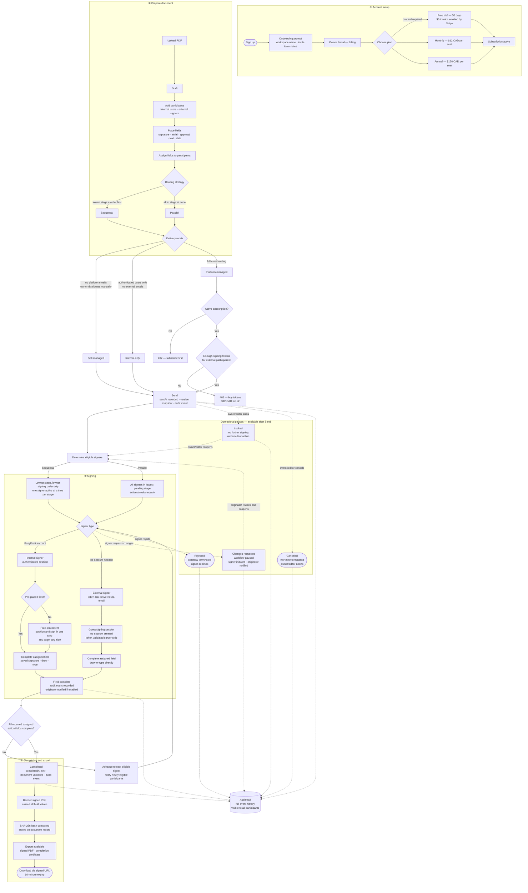

# Workflow Reference

## First-principles goals

- always show what the document is waiting on
- always show who needs to act next
- always give the initiator a clean update at meaningful stage changes
- always provide a safe path when a participant is blocked, wrong, or unavailable
- always make edits after partial completion understandable and auditable
- always close the loop with a clear completion package

---

## Current workflow diagram

---

## Document states

| State | Condition |
|---|---|
| `draft` | Uploaded; no fields placed yet |
| `prepared` | Fields placed but not sent |
| `sent` | `sentAt` set; no fields completed |
| `partially_signed` | At least one required field completed; not all |
| `completed` | All required assigned action fields complete |
| `reopened` | Previously locked or completed; reopened for further signing |

Operational pauses overlay any state: `changes_requested`, `rejected`, `canceled` block further signing without changing the base state.

---

## Delivery mode comparison

| Mode | Who gets emailed | Signing access | Token cost |
|---|---|---|---|
| Self-managed | Nobody | Internal users sign in; owner distributes links manually | None |
| Internal-only | Internal signers only | Authenticated EasyDraft users only | None |
| Platform-managed | All eligible signers | Internal users sign in; external signers use token link | 1 token per external workflow sent |

---

## Routing strategy comparison

| Strategy | Who signs when | Use case |
|---|---|---|
| Sequential | One signer at a time — lowest stage, lowest order first | Approval chains where order matters |
| Parallel | All signers in the current stage at once | Peer review, simultaneous approvals |

Stages can be combined: stage 1 parallel among three reviewers, stage 2 sequential for two final approvers.

---

## Field types

| Kind | Action field | Description |
|---|---|---|
| `signature` | Yes | Full signature — draw, type, or use saved signature |
| `initial` | Yes | Abbreviated signature — same options as signature |
| `approval` | Yes | Checkbox approval — no drawn signature required |
| `text` | No | Free-form text input |
| `date` | No | Date picker |

Only action fields (`signature`, `initial`, `approval`) count toward workflow completion. Text and date fields are informational.

---

## Permissions

| Role | Send | Lock/Reopen | Cancel | Sign fields | Buy tokens |
|---|---|---|---|---|---|
| Owner | ✓ | ✓ | ✓ | — | ✓ |
| Editor | ✓ | ✓ | ✓ | — | — |
| Signer | — | — | — | ✓ (assigned only) | — |
| Viewer | — | — | — | — | — |

Owners and editors cannot sign their own fields. Signers cannot lock, reopen, or cancel.

---

## Future additions worth prioritising

These are not yet implemented. Add them when there is proven demand:

- **Certificate-backed PDF signing** — PAdES/CAdES embedding via `easy_draft_remote`, `qualified_remote`, or `organization_hsm` provider. The `DigitalSignatureProfile` model and UI already exist; only the provider wiring is missing.
- **Change-impact classification** — classify edits made after partial signing as `non_material`, `review_required`, or `resign_required` rather than treating all edits the same.
- **Purpose-built signer page** — replace the current sidebar layout for external signers with a focused signing experience that shows the document prominently with field highlights.
- **Stage-level originator updates** — send one email per stage completion rather than one per field to reduce notification noise on large documents.
- **Overdue escalation** — auto-reassign or auto-remind when a due date passes and the signer has not acted.
