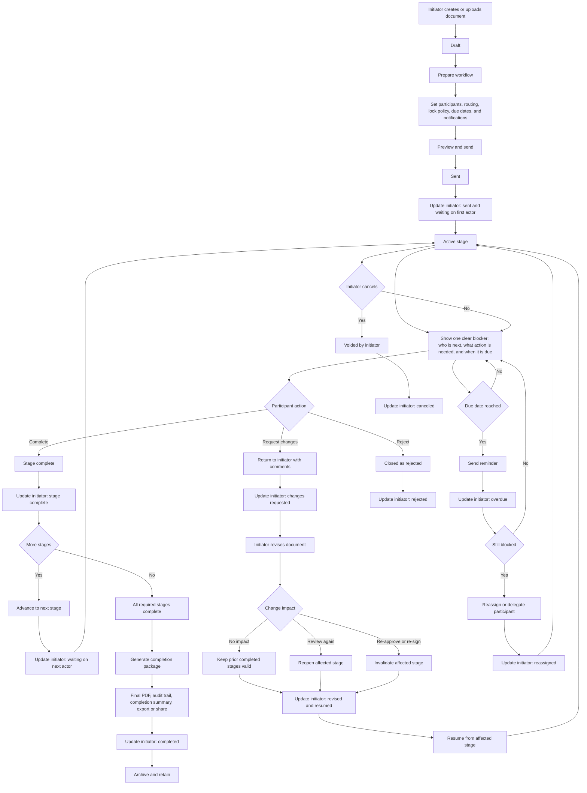

# Future Workflow Roadmap

This roadmap keeps future workflow work straightforward and tied to the pains people actually feel in document flow.

## First-principles goals

- always show what the document is waiting on
- always show who needs to act next
- always give the initiator a clean update at meaningful stage changes
- always provide a safe path when a participant is blocked, wrong, or unavailable
- always make edits after partial completion understandable and auditable
- always close the loop with a clear completion package

## Future-state additions worth prioritizing

- explicit `waiting on` status
- simple due dates, reminders, and overdue status
- reassign or delegate participant
- request changes back to initiator
- cancel or void by initiator
- change-impact handling after partial completion
- final completion package with PDF, audit trail, summary, and export/share
- stage-level initiator updates instead of noisy updates for every tiny event

## Future-state Mermaid

## Notes for implementation planning

- Keep the current core lifecycle simple: `draft`, `prepared`, `sent`, `partially_signed`, `completed`, `reopened`.
- Treat reject, changes requested, overdue, reassigned, canceled, and blocked states as operational statuses first.
- Keep routing as dimensions on one engine: participant type, routing strategy, stage, delivery mode, and lock policy.
- Prefer stage-level initiator updates over event spam.
